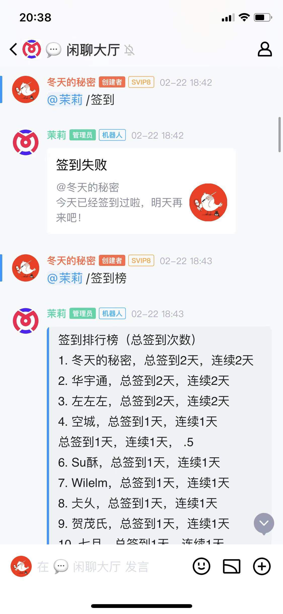
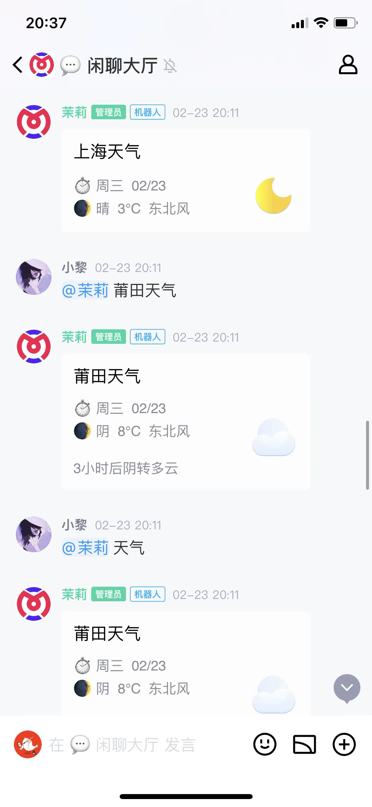
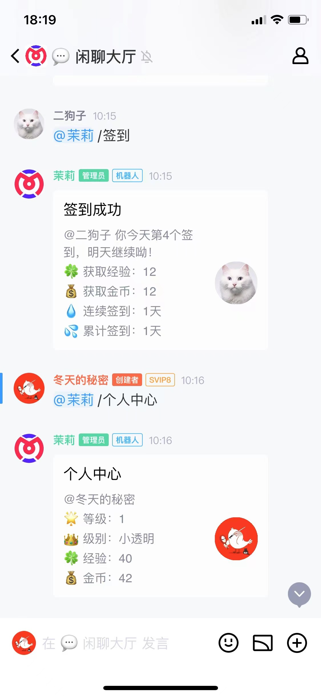
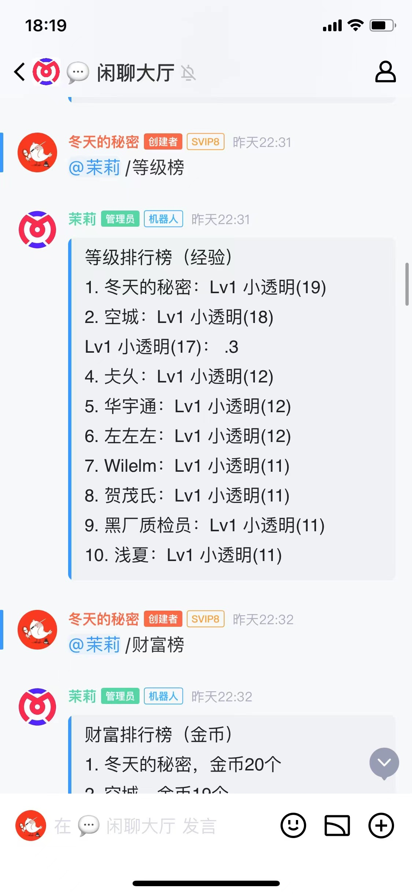

## 茉莉qq频道机器人（简称mqb）

### 介绍
开箱即用的qq频道机器人脚手架，支持签到、天气预报、笑话、一言、查成语、翻译、成语接龙等等功能；

特别的还支持Ai闲聊对话，支持自定义知识库（需前往茉莉云配置）。

### 软件架构
`mqb` 使用java语言（jdk 11）开发，使用springboot框架。

### 启动运行
1、修改`application.yml`配置文件里面的qq频道机器人`bot-app-id`和`bot-token`，以及茉莉云机器人Api；

2、运行Application类即可启动服务。

### QQ频道机器人开放平台
https://bot.q.qq.com

### 茉莉云Api
https://mly.app

### 效果截图

